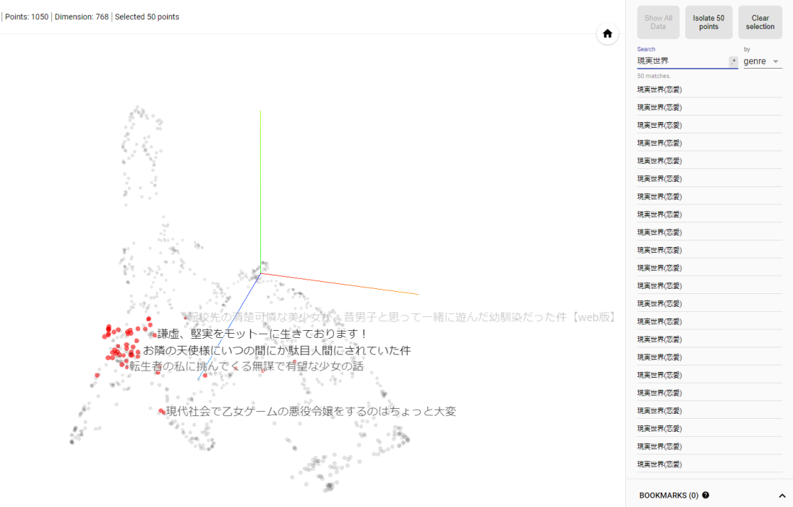
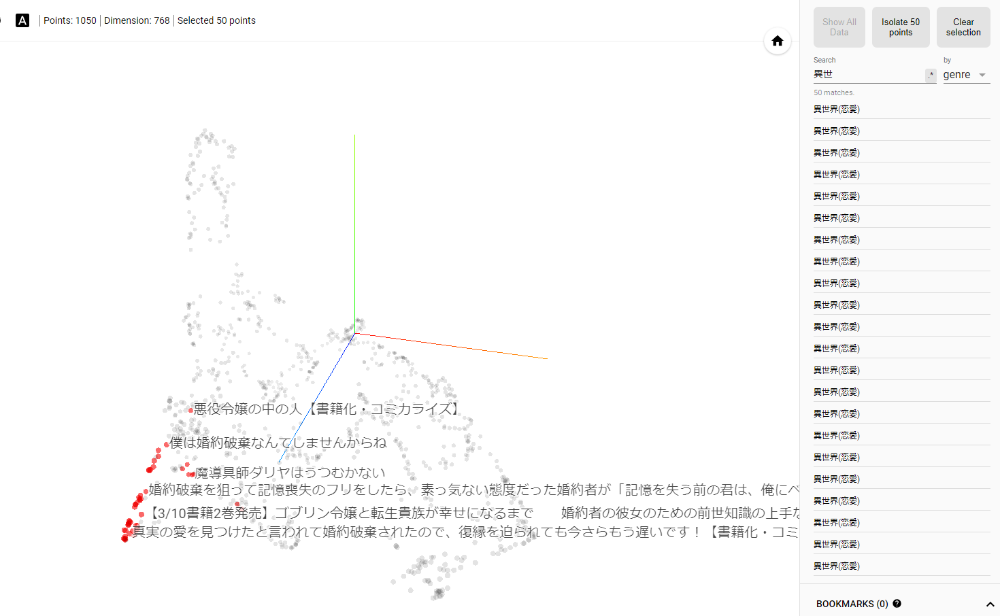
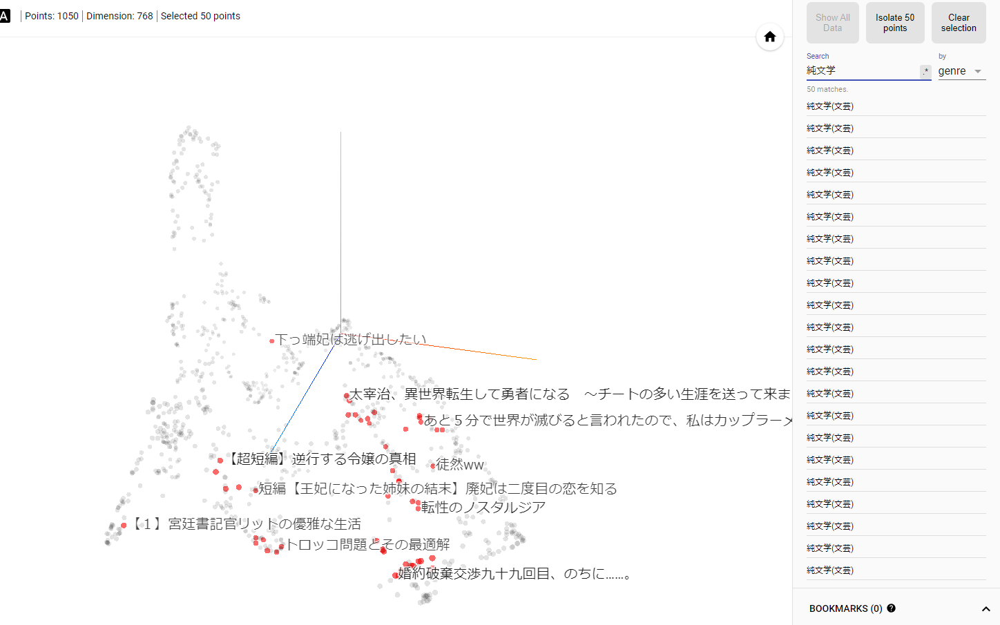
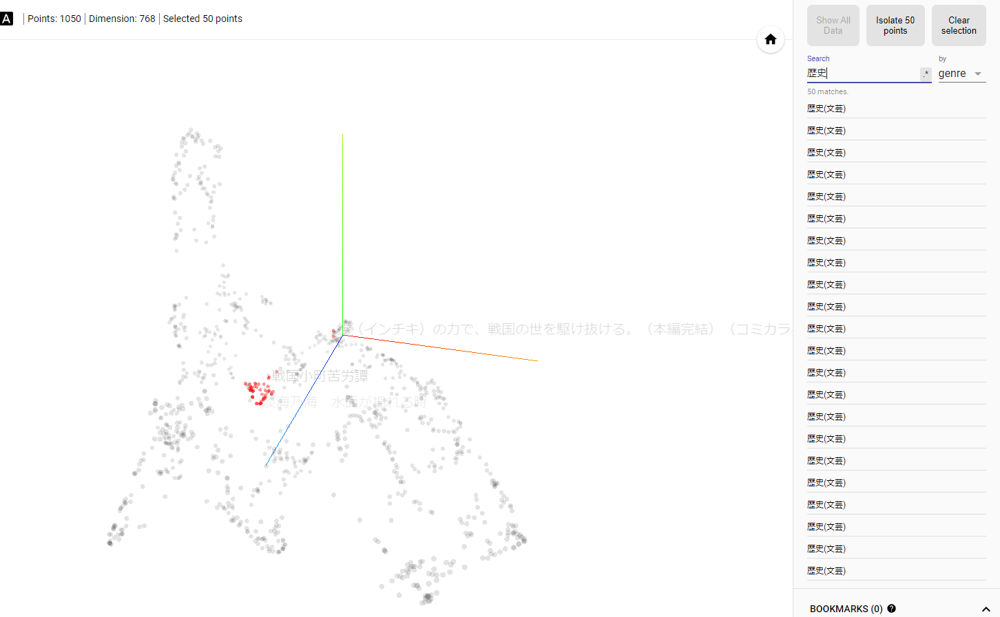

# 「小説家になろう」のコンテンツ類似度の可視化

## 小ジャンル一覧
- 異世界(恋愛)
- 現実世界(恋愛)
- ハイファンタジー(ファンタジー)
- ローファンタジー(ファンタジー)
- 純文学(文芸)
- ヒューマンドラマ(文芸)
- 歴史(文芸)
- 推理(文芸)
- ホラー(文芸)
- アクション(文芸)
- コメディー(文芸)
- VRゲーム(SF)
- 宇宙(SF)
- 空想科学(SF)
- パニック(SF)
- 童話(その他)
- 詩(その他)
- エッセイ(その他)
- リプレイ(その他)
- その他(その他)
- ノンジャンル(ノンジャンル)

## 仕様
- ベースモデル: 東北大BERT
- fine turning: なろうAPIによって取得したデータ
- 埋め込み: CLS

## 課題
1. 学習に使用できるデータが制限されてしまう
    - ネット小説の為、あらすじ欄に必ずしもその小説を表しているあらすじが書かれているとは限らない事が理由
2. 作品数が多すぎる

## 解決策
1. 学習データは通算評価が多い順のn件のみとする（評価が多い小説=あらすじ欄が適切であるものが多いと仮定）
2. 実験的に月間評価数と、通算評価数が高いユーザを1000件ほどのみ対象

## 例

現実世界(恋愛)と異世界(恋愛)はそれぞれ分散が小さく、特徴空間上での近い。（恋愛という点で共通）

対称的に純文学は分散が大きい

歴史はかなり分散が小さい
